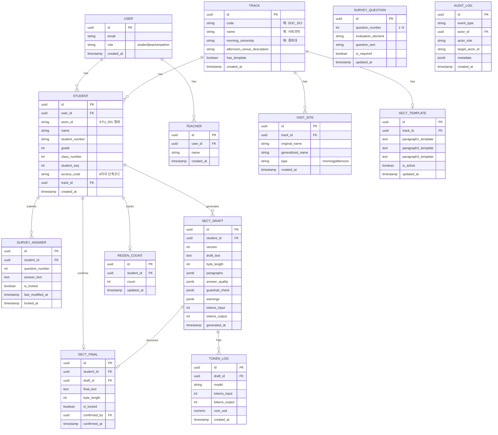

# PRD: 현장체험학습 세특 자동 생성 웹 앱

> 버전: v1.1 | 최종 수정: 2026-05-12

---

## 이해 요약

이 제품은 고등학교 2학년 현장체험학습(오전 대학 탐방 + 오후 계열별 체험) 종료 후, 학생 180명이 제출한 9문항 서술형 설문 답변을 Claude Sonnet 4.5가 분석하여 **계열별 고정 골격 템플릿에 학생 개별 내용만을 삽입**하는 세특 초안을 자동 생성하는 웹 앱이다. 핵심 가치는 AI가 학생 답변 이외의 내용을 절대 생성하지 않는 "하이브리드 템플릿 채우기" 방식으로, 교사는 AI 초안 검토 후 확정하고 엑셀로 내보내 NEIS에 붙여넣는다.

사회과학계열 템플릿 1개를 보유한 상태로 MVP를 출시하고, 나머지 11개 계열은 동일 패턴을 AI가 자동 변주한다. 학생 개인정보(이름·학번)는 API 호출 시 익명 ID로 치환되며, API 키는 서버 환경변수로만 관리된다.

---

## 핵심 가정 3가지

1. **학생은 체험 당일(5/28) 현장에서 스마트폰으로 응답하며, 5/31 자정까지 수정 가능하다** — 제출 잠금은 응답 기간 종료 후 자동 처리.
2. **교사 1인(또는 인솔교사 복수)이 전체 계열 검토를 담당한다** — 계열별 담당 교사 분리 없음.
3. **체험처 고유명사 일반화는 AI가 자동 처리한다** — 교사가 사전에 체험처별 "일반화 표현"을 관리자 콘솔에 등록하며, AI는 이를 우선 참조.

---

## 목차

1. 제품 개요
2. 운영 환경 및 사용자
3. 설문 9문항
4. 세특 작성 규정 (Hard Constraints)
5. API 키 및 비용 관리 정책
6. 세특 생성 핵심 로직
7. 기능 요구사항
8. AI 프롬프트 설계 사양
9. 비기능 요구사항 (NFR)
10. 데이터 모델 (ERD)
11. 화면 정의서
12. API 명세
13. 보안·개인정보 처리 방침
14. MVP 범위 vs Phase 2 로드맵
15. KPI
16. Risk & Mitigation
17. 개발 마일스톤 (4주)
18. 가정 (Assumptions)
19. 확인 필요 질문 (Open Questions)

---

## 1. 제품 개요

| 항목 | 내용 |
|------|------|
| 제품명 | 현장체험학습 세특 생성 시스템 (가칭: **FieldNote**) |
| 목적 | 현장체험학습 설문 답변 → AI 세특 초안 자동 생성 → 교사 검토·확정 → 엑셀 내보내기 → NEIS 붙여넣기 |
| AI 모델 | Claude Sonnet 4.5 (`claude-sonnet-4-5`) |
| 핵심 제약 | 학생 답변 외 내용 생성 절대 금지 / 900 Byte 초과 금지 / 개인정보 API 전송 금지 |

---

## 2. 운영 환경 및 사용자

### 운영 환경

| 항목 | 값 |
|------|-----|
| 대상 학년 | 고등학교 2학년 전체 |
| 학생 수 | 180명 |
| 진로 계열 수 | 12개 |
| 체험학습일 | **2026-05-28** |
| 응답 제출 기간 | **2026-05-28 09:00 ~ 2026-05-31 자정** |
| 활동 구성 | 오전: 대학 탐방 / 오후: 계열별 체험 장소 |
| 배포 환경 | Vercel + Supabase |

### 12개 진로 계열 전체 데이터

| # | 계열 | 인원 | 탐방 대학 | 오후 체험 장소 (원본) | 체험 내용 | 장소 일반화 표현 (세특용) |
|---|------|------|-----------|----------------------|-----------|--------------------------|
| 1 | 사회과학 | 20 | 경희대 | 서울시청 (통통 투어) | 해설사와 함께 시청사 투어 | 해설사가 있는 시청 건물 |
| 2 | 사범대 | 8 | 경희대 | 광나루 안전체험관 | 재난안전체험 | 재난 안전체험관 |
| 3 | 체육, 재활 | 9 | 경희대 | 블랙야크 아크돔 | 스포츠 클라이밍 교육과 아크돔 체험 | 실내 스포츠 체험 시설 |
| 4 | 미술, 애니, 음악 | 25 | 경희대 | 국립현대미술관 | 미술관 전시 해설 및 자유 관람 | 국립미술관 |
| 5 | 개별반 | 1 | 경희대 | 경희대 미술관 | 카페쿠피 견학 및 미술관 관람 | 대학 미술관 |
| 6 | 이과 | 14 | 덕성여대 | 서울시립과학관 | 토양 오염 및 환경 검사 실험 | 과학관 |
| 7 | 바이오, 약학 | 11 | 덕성여대 | 서울시립과학관 | 음료 속 카페인을 찾아라 실험 | 과학관 |
| 8 | 인문 | 18 | 동덕여대 | 성북근현대문학관 | 상설 전시 해설 및 특별 전시 관람 | 근현대문학관 |
| 9 | 미디어 | 16 | 동덕여대 | 서울시청자미디어센터 | 뉴스 제작 체험 | 미디어 체험 센터 |
| 10 | 공과 | 15 | 이화여대 | 서울에너지드림센터 | 호모클리마투스의 집짓기 체험 | 에너지 전문 체험관 |
| 11 | 경영 | 23 | 한국외대 | 한국은행 화폐박물관 | 화폐박물관 전시 해설 및 자유관람 | 화폐박물관 |
| 12 | 보건, 간호 | 19 | 한국외대 | 서울대학교병원 의학박물관 | 박물관 전시 해설 및 자유관람 | 대학병원 의학박물관 |

> **총 인원**: 179명 (이미지 기준) — 학생 명단 업로드 시 최종 확정.

### 핵심 사용자 (Personas)

| 역할 | 행동 | 목표 |
|------|------|------|
| **학생** | 체험 당일 스마트폰으로 9문항 답변 제출, 기간 내 수정 가능 | 빠르고 편하게 제출 |
| **인솔 교사 (Teacher)** | 공용 교사 계정 로그인 → 담당 계열 선택 → AI 초안 검토·확정 → 엑셀 다운로드 → 수정 후 엑셀 재업로드 | 세특 작성 시간 단축 |
| **담임 교사 (Homeroom Teacher)** | 공용 교사 계정 로그인 → "담임" 선택 → 담당 반 선택 → 반 학생 최종 세특 조회 → 엑셀 내보내기 → NEIS 업로드 | 반별 세특 일괄 NEIS 입력 |
| **관리자 (Admin, 부장교사)** | 계열·체험처·학생명단·템플릿 관리, 진행률 모니터링 | 전체 운영 통제 |

> **접근 제한**: 학생·인솔교사·관리자 외 학부모를 포함한 모든 외부인의 접근을 차단한다.

---

## 2-α. 권한·노출 정책 (핵심 전제 — 변경 불가)

> 세특은 **교사가 작성하는 공식 학교 기록**이다.
> AI 생성 결과를 학생이 사전 열람하면 공정성 훼손 및 입시 부정 이슈가 발생한다.

| 대상 | 볼 수 있는 것 | 볼 수 없는 것 |
|------|-------------|-------------|
| **학생** | 자신의 설문 답변만 | AI 초안, 세특 확정본, 다른 학생 정보 일체 |
| **인솔교사** | 담당 계열 학생의 답변 + AI 초안 + 확정본 | 다른 계열 학생 정보 |
| **담임교사** | 담당 반 학생의 세특 최종본만 | AI 초안, 다른 반 학생 정보, 학생 원답변 |
| **관리자** | 전체 (교사 권한 포함) + 시스템 설정 | — |

### 세부 규칙

1. **학생 화면에는 AI 생성 관련 문구를 일절 표시하지 않는다** — "세특 작성 중", "AI 분석 중" 등 암시적 표현도 금지.
2. **학생용 API 엔드포인트는 세특 데이터를 반환하지 않는다** — 서버 레벨에서 강제 차단.
3. **AI 생성 트리거는 교사가 수동으로 실행한다** — 학생 제출 즉시 자동 트리거 금지.
4. **권장 워크플로우**: 5/31 자정 마감 → 교사가 일괄 생성 요청 → 일괄 검토·확정 → 엑셀 내보내기.

---

## 3. 설문 9문항

| 번호 | 평가 요소 | 필수 | 질문 내용 |
|------|-----------|------|-----------|
| 1 | 전공역량 | **필수** | 전공하고 싶은 계열(혹은 구체적인 학과)을 적고, 오전 대학 탐방에서 대학생 멘토나 본인의 희망 계열 선배 혹은 관련 시설을 통해 새롭게 알게 된 '전공자가 갖춰야 할 핵심 자질'은 무엇인지 적으세요 |
| 2 | 오늘 활동 핵심 정리 | **필수** | 오늘 종일 체험을 아우르는 본인만의 활동 경험을 한 문장으로 정의해 보세요. (예: 경제학적 관점에서 본 화폐의 역사와 미래 결제 시스템 연구 등) |
| 3 | 심화 관찰 | **필수** | 오후 체험 장소에서 전시물이나 프로그램을 접하며 본인의 희망 진로와 연결하여 가장 흥미롭게 다가온 지점은 무엇이었는지 구체적으로 적어주세요. |
| 4 | 탐구 확장 | **필수** | 체험을 마친 후 더 깊이 공부해보고 싶어진 구체적인 주제나 도서 혹은 후속 탐구 활동 계획이 생겼다면 무엇인지 적어주세요. |
| 5 | 성장 기록 | **필수** | 이번 체험학습을 통해 본인의 진로에 대한 확신이 생겼거나 반대로 새로운 방향을 고민하게 되었다면 구체적으로 적어주세요. |
| 6 | 자기 주도적 로드맵 | **필수** | 오전에 대학의 모습과 오후 체험학습 현장 모습을 종합해 볼 때, 본인이 희망 전공에 진학하기 위해 남은 고등학교 생활 동안 보완해야겠다고 느낀 구체적인 학업적 역량이나 활동 계획은 무엇인지 구체적으로 적어주세요 |
| 7 | 융합적 사고 | 선택 | 오늘 체험한 내용 중 학교 교과 수업에서 배운 이론이 실제 현장에서 어떻게 적용되고 있는지 발견한 것이 있다면 적어주세요. |
| 8 | 문제 해결 | 선택 | 해당 계열의 전문가들이 현재 직면하고 있는 사회적 고민이나 기술적 한계점 혹은 미래 과제에 대해 새롭게 깨달은 점이 있나요? |
| 9 | 직업 윤리 | 선택 | 현장체험학습을 통해 '미래의 나'가 계열 관련 직업인으로서 일하고 있다고 가정했을 때, 가장 중요하게 지켜야 할 직업윤리나 가치는 무엇이라고 느꼈나요? |

---

## 4. 세특 작성 규정 (Hard Constraints)

### 4-1. 절대 원칙

1. **오직 학생 답변만을 근거로 작성한다.** 외부 지식·일반론·격려 표현·추측·과장·보충 일체 금지.
2. 학생 답변에 없는 사실·활동·감정·다짐은 **절대로** 생성하지 않는다.
3. 답변이 부실하면 **부실한 세특을 그대로 도출**한다.
4. 분량이 850~900 Byte에 미달해도 학생 답변에 근거가 없으면 **그대로 종료**한다.

### 4-2. 분량

- **NEIS 관행 기준: 한글 1자 = 2 Byte, 영문/숫자/공백 = 1 Byte**
- 목표 범위: 850~900 Byte (상한 절대 초과 금지)
- 답변 부실 시 미달 허용

### 4-3. 문체

- **평어체(음슴체)**: `~함`, `~임`, `~음`으로 종결
- 주어 생략 (주어 = 학생 본인)

### 4-4. 금지 표현

| 카테고리 | 예시 | 처리 방식 |
|----------|------|-----------|
| 지역명 | 서울, 강남구, 종로 등 | 카테고리 표현 또는 삭제 |
| 대회명 | OO경진대회 등 | 삭제 |
| 기관/기업/학원명 | OO대학교, △△병원 | "대학", "병원" 등으로 일반화 |
| 외부 수상 실적 | — | 전면 금지 |
| 어학 시험 점수 | TOEIC, TEPS 등 | 전면 금지 |
| 논문 게재·투고 | — | 전면 금지 |
| 부모·가족 정보 | — | 전면 금지 |
| 모의고사·수능 성적 | — | 전면 금지 |

**허용 예외**: 학과명(행정학과, 간호학과 등), 보통명사화된 제도·개념(주민 참여예산제, 탄소중립 등)

---

## 5. API 키 및 비용 관리 정책

### 5-1. API 키 관리

- `ANTHROPIC_API_KEY`는 **서버 측 환경변수로만 관리** — 클라이언트 노출 절대 금지
- 모든 AI 호출은 서버 Route Handler 경유
- `.env.example` 제공, 실제 `.env`는 `.gitignore` 제외

### 5-2. 학생 데이터 보호

- API 호출 시 이름·학번을 **익명 ID(`STU_001` 등)로 치환**
- 실제 식별정보는 학교 DB에만 저장
- 응답 수신 후 서버에서 익명 ID → 실제 학생 재매핑

### 5-3. 비용 통제 및 예상 비용

- 학생당 재생성 횟수 **최대 5회** 제한
- **프롬프트 캐싱 적용** — 시스템 프롬프트(고정)는 캐시 처리로 호출 비용 약 50% 절감
- 예상 비용: 초기 생성 ~$4 / 재생성 포함 현실적 ~$8 / 최악(전원 5회) ~$22
- 일일 토큰 임계치 초과 시 관리자 알림
- 모든 API 호출의 입력/출력 토큰 수 DB 로깅
- 관리자 콘솔에 월 누적 사용량·예상 비용 대시보드 제공

### 5-4. 보안 점검 항목

- HTTPS 강제 (HTTP 차단)
- API 호출 로그에는 익명 ID만 기록, 학생 답변 원문 비로깅
- Vercel/Supabase Secret Manager 활용

---

## 6. 세특 생성 핵심 로직

### 6-1. 하이브리드 방식

- **공통 골격**: 계열별 고정 템플릿으로 DB 사전 등록 → AI 변경 불가
- **개별 삽입부**: AI가 학생 답변 근거로만 생성

### 6-2. 3문단 구조 및 답변 매핑

| 문단 | 공통 골격 | AI 삽입 근거 |
|------|-----------|-------------|
| 문단 1: 오전 대학 탐방 | "오전 대학 탐방에서 멘토와의 질의응답을 통해 [학과명] 진학에 대한 이해도를 높이고 핵심 자질로서 [자질] 함양에 대한 열의를 다짐." | **Q1** (전공역량) |
| 문단 2: 오후 체험 | "오후 계열별 체험 장소인 [체험처]을 방문하여 [실무 과정] 관찰함. 특히 [흥미 지점]을 통해 [깨달음] 깨달음을 얻음." | **Q2 + Q3** (활동 핵심 정리 + 심화 관찰) |
| 문단 3: 사후 확장·다짐 | "현장체험학습 이후, [관심 주제]에 관심을 갖게 되어 [탐구 계획]을 탐구해보고자 함. 또한 [다짐]을 실천하기로 다짐함." | **Q4 + Q5 + Q6** (탐구 확장 + 성장 기록 + 로드맵) |

### 6-3. 선택 답변 활용 규칙

- **Q7(융합적 사고)만** 보너스 활용 대상: 50자 이상이고 학생 특성이 잘 드러나는 경우에 한해 문단 3에 자연스럽게 추가
- Q8·Q9 답변은 세특 본문에 미사용 (참고용)

### 6-4. 답변 품질 플래그 (필수 답변 Q1~Q6 대상)

| 플래그 | 트리거 | 표시 |
|--------|--------|------|
| `SUFFICIENT` | 50자 이상 + 평가요소 일치 + 구체적 사례 | ✅ |
| `INSUFFICIENT` | 20자 미만 OR 불일치 OR 반복 표현 | ⚠️ 근거 부족 |
| `EMPTY` | 미응답 OR "없음"/"모름" | ❌ 응답 없음 |

`INSUFFICIENT` 또는 `EMPTY`가 하나라도 있으면 세특 카드 상단에 **"근거 부족 경고 배지"** 표시.

### 6-5. 12계열 템플릿 운영 정책

- **MVP**: 사회과학계열 1개 등록 상태로 출시
- 미등록 11개 계열: AI가 사회과학 패턴을 해당 계열·학과·답변 어휘에 맞춰 자동 변주
- **Phase 2**: 관리자 콘솔에서 계열별 템플릿 직접 등록·편집
- DB 스키마는 처음부터 12계열 모두 수용 가능하게 설계

---

## 7. 기능 요구사항

### F-001 — 관리자: 계열 CRUD (P0)

계열 코드, 계열명, 오전 탐방 대학, 오후 체험처 정보 관리.

**AC**:
- 계열 삭제 시 연결 학생 있으면 차단 + 경고
- 12계열 초기 데이터 seed 스크립트 포함

---

### F-002 — 관리자: 학생 명단 일괄 업로드 (P0)

CSV/엑셀 파일로 학생 명단 및 계열 매핑 일괄 등록.

**AC**:
- 헤더: 학년, 반, 번호, 성명, 계열코드
- 중복 학번 감지 시 덮어쓰기 여부 확인 모달
- 업로드 결과 요약 + 오류 행 CSV 다운로드

---

### F-003 — 관리자: 세특 템플릿 CRUD (P0)

계열별 세특 공통 골격(문단 1·2·3) 및 `[개별]` 슬롯 관리.

**AC**:
- 3문단 각각 편집 가능한 UI
- 저장 시 슬롯 개수 유효성 검증
- 미등록 계열은 "기본 패턴 적용" 배지 표시

---

### F-004 — 관리자: 진행률 대시보드 (P0)

학급/계열별 응답 완료율, AI 생성 완료율, 교사 확정 완료율 실시간 조회.

**AC**:
- 계열·학급 필터 적용 가능
- 미응답 학생 목록에서 단축 코드 확인 가능

---

### F-005 — 관리자: 단축 코드 발급 (P0)

학생별 6자리 로그인 코드 자동 생성 및 일괄 CSV 내보내기.

**AC**:
- 영숫자 6자리 랜덤 생성
- CSV 내보내기: 학번, 성명, 코드
- 코드 재발급 시 기존 코드 즉시 만료

---

### F-006 — 학생: 단축 코드 로그인 (P0)

6자리 단축 코드 + 이름 확인으로 설문 접근.

**AC**:
- 코드 입력 → 이름 자동 표시 → "맞습니다" 확인 후 진입
- 3회 오입력 시 5분 잠금
- JWT 세션 발급 (유효시간 48시간)

---

### F-007 — 학생: 설문 응답 입력 및 수정 (P0)

9문항 서술형 입력, 임시 저장, 수정, 최종 제출.

**AC**:
- 필수 문항(Q1~Q6) 미입력 시 제출 버튼 비활성화
- 각 문항 하단 실시간 글자 수 카운터
- 툴팁 클릭 시 평가요소 설명 표시
- 30초마다 자동 임시 저장
- **응답 기간(~5/31 자정) 내 언제든 재수정 가능** — 수정 시 이전 버전 덮어쓰기
- 응답 기간 종료(5/31 자정) 후 자동 잠금 (학생 수정 불가)
- 모바일 우선 레이아웃 (버튼 최소 44×44px, 폰트 최소 16px)

---

### F-008 — 학생: 응답 기간 자동 잠금 (P0)

2026-05-31 자정 이후 학생 답변 자동 잠금.

**AC**:
- 잠금 후 학생 재접속 시 읽기 전용 모드 표시
- 잠금 전 "D-N일 마감" 안내 배너 표시
- 교사는 개별 학생 잠금 해제 가능 (사유 입력 필수, 감사 로그 기록)

---

### F-009 — AI: 세특 초안 생성 (P0)

Claude Sonnet 4.5 호출, 계열 템플릿 + 학생 답변 기반 세특 초안 생성.

**AC**:
- 입력: 익명화된 학생 답변 + 계열 메타데이터 + 공통 골격 템플릿 + 세특 규정
- 출력: 지정 JSON 스키마
- **프롬프트 캐싱 적용** (시스템 프롬프트 고정 구간)
- 비동기 큐 처리, 평균 응답시간 30초 이내
- 실패 시 최대 2회 자동 재시도 (exponential backoff)
- 토큰 사용량(input/output) + 예상 비용 DB 로깅

---

### F-010 — AI: 재생성 (P1)

교사 지시에 따른 부분 재생성.

**AC**:
- 재생성 유형: "전체 재생성" / "특정 문단만" / "분량 미세조정 (+/-50 Byte)"
- 학생당 잔여 재생성 횟수 UI 표시 (5회 중 N회 남음)
- 5회 초과 시도 시 차단 메시지 표시

---

### F-011 — 교사: 학생 카드 뷰 (P0)

좌(학생 원답변 9개) / 우(AI 세특 초안 + 플래그) 분할 화면.

**AC**:
- 좌측: 9개 문항 원문 + 각 답변의 품질 플래그 아이콘
- 우측: 세특 초안 + 분량 Byte 실시간 카운터 (NEIS 기준)
- 근거 부족 경고 배지: `INSUFFICIENT` 또는 `EMPTY` 1개 이상 시 상단 표시
- 우측 세특 텍스트 인라인 편집 가능 (확정 전)
- 변경 이력 자동 저장 (최대 10개 버전)

---

### F-012 — 교사: 확정 및 엑셀 내보내기 (P0)

개별/일괄 확정, 엑셀 파일로 내보내기 (NEIS 붙여넣기 및 수정용).

**AC**:
- 개별 확정: 잠금(Lock) 처리
- 일괄 확정: 필터된 학생 전체 처리
- **내보내기 엑셀 컬럼**: 학년 / 반 / 번호 / 학번 / 성명 / 계열 / 세특 확정본 / 생성일 / 확정일
- 미확정 학생 포함 내보내기 시 경고 표시
- **확정 후 세특 수정은 엑셀 파일에서 직접 편집** — 인앱 재편집 기능 없음

---

### F-013 — 시스템: RBAC (P0)

학생/인솔교사/관리자 역할 분리. 학부모 포함 외부인 접근 전면 차단.

**교사 계정 구조**: 공용 단일 계정(이메일+비밀번호 공유) — 개인별 계정 발급 없음.
**계열 스코프**: 로그인 직후 "담당 계열 선택" 화면 → JWT에 `scoped_track_ids` 포함 → 이후 모든 데이터 조회는 선택한 계열로 자동 필터.

**AC**:
- 학생: 자신의 설문 답변만 접근 — **세특 초안·확정본 엔드포인트 접근 시 403 강제 반환**
- 학생 JWT로 `/api/sect/**` 경로 호출 시 미들웨어에서 즉시 차단 (라우트 핸들러 도달 전)
- 인솔교사: JWT의 `scoped_track_ids`에 포함된 계열 학생만 조회·편집·내보내기 가능
- 다른 계열 학생 데이터 요청 시 403 반환
- 계열 선택은 세션마다 새로 선택 (복수 선택 가능 — 2개 계열 인솔 시 모두 선택)
- 담임교사: JWT의 `scoped_class`에 해당하는 반 학생의 `sect_final`만 조회 가능
- 담임교사는 학생 원답변·AI 초안(`sect_draft`) 엔드포인트 접근 시 403 반환
- 관리자: 계열 제한 없이 전체 접근 + 시스템 설정

---

### F-014 — 시스템: 감사 로그 (P1)

주요 이벤트(생성·수정·확정·내보내기·잠금해제) 자동 기록.

**AC**:
- 로그 항목: 이벤트 유형, 수행자(역할+익명ID), 대상 학생(익명ID), 타임스탬프
- 원문 답변 미포함
- 관리자 콘솔에서 조회 가능

---

### F-016 — 인솔교사: 수정본 엑셀 재업로드 (P0)

인솔교사가 엑셀에서 수정한 세특 최종본을 앱 DB에 다시 반영.

**AC**:
- 업로드 파일 형식: `.xlsx` (F-012 내보내기 파일과 동일 구조)
- 필수 컬럼 존재 여부 검증 (학번, 세특 최종본)
- 학번 기준으로 기존 `sect_final.final_text` 덮어쓰기
- 컬럼 누락·학번 불일치 행은 오류 리포트로 제공
- 업로드 완료 후 "최종본 업로드 완료 N명" 확인 화면 표시
- 업로드 이력 감사 로그 기록

---

### F-017 — 담임교사: 반별 최종 세특 조회 및 내보내기 (P0)

담임교사가 자신의 반 학생 세특 최종본을 조회하고 NEIS용 엑셀로 내보내기.

**AC**:
- 공용 교사 계정 로그인 후 "담임교사" 선택 → 반 선택 (2-1 ~ 2-6 등)
- JWT에 `role: homeroom`, `scoped_class: "2-3"` 포함
- 담당 반 학생 목록 + 세특 최종본 + 확정 상태 표시
- 미확정(또는 미업로드) 학생은 별도 표시
- 내보내기 엑셀 컬럼: 학년 / 반 / 번호 / 학번 / 성명 / 세특 최종본
- 학생 원답변·AI 초안은 담임교사 화면에 노출하지 않음

---

### F-015 — 시스템: 데이터 자동 파기 (❌ 취소 — 2026-06-08 운영자 결정)

> **이 기능은 폐기되었다. 구현 금지.**
> 운영자(교사) 지시에 따라 **데이터는 자동으로 파기하지 않는다.** 삭제는 운영자가 명시적으로 요청할 때만 수동으로 수행한다.
> 자동 파기 크론잡·예약 삭제·기간 만료 삭제를 일절 만들지 않는다.

---

## 8. AI 프롬프트 설계 사양

### 8-1. 시스템 프롬프트 (완성본, 실제 호출용)

```
당신은 고등학교 진로 체험학습 세부능력 및 특기사항(세특) 작성 전문가입니다.

━━━━━━━━━━━━━━━━━━━━━━━━━━━━━━━━━━━━━━━━━━
## 최상위 원칙 (Hard Constraints) — 어떠한 경우에도 위반 불가
━━━━━━━━━━━━━━━━━━━━━━━━━━━━━━━━━━━━━━━━━━

1. 오직 학생 답변만을 근거로 작성합니다. 외부 지식, 일반론, 격려 표현, 추측, 과장, 보충 일체를 추가하지 않습니다.
2. 학생 답변에 없는 사실, 활동, 감정, 다짐은 절대로 생성하지 않습니다.
3. 답변이 부실하면 부실한 세특을 그대로 도출합니다. 분량을 채우기 위한 일반적 미사여구 추가는 금지입니다.
4. 분량이 850~900 Byte에 미달해도 학생 답변에 근거가 없다면 그대로 종료합니다.

━━━━━━━━━━━━━━━━━━━━━━━━━━━━━━━━━━━━━━━━━━
## 분량 규정
━━━━━━━━━━━━━━━━━━━━━━━━━━━━━━━━━━━━━━━━━━

- 바이트 산정: 한글 1자 = 2 Byte / 영문·숫자·공백·특수문자 = 1 Byte (NEIS 관행 기준)
- 목표 범위: 850~900 Byte (학생 답변이 풍부할 때의 상한)
- 900 Byte 절대 초과 금지
- 답변 부실 시 미달 허용 — 채우기 위한 추가 문장 작성 금지

━━━━━━━━━━━━━━━━━━━━━━━━━━━━━━━━━━━━━━━━━━
## 문체 규정
━━━━━━━━━━━━━━━━━━━━━━━━━━━━━━━━━━━━━━━━━━

- 평어체(음슴체): 모든 문장을 ~함, ~임, ~음 으로 종결
- 주어 생략 (주어 = 학생 본인)
- 올바른 예: "행정학과 진학에 대한 이해도를 높이고 열의를 다짐."
- 잘못된 예: "학생은 행정학과 진학에 관심을 보였습니다."

━━━━━━━━━━━━━━━━━━━━━━━━━━━━━━━━━━━━━━━━━━
## 금지 표현
━━━━━━━━━━━━━━━━━━━━━━━━━━━━━━━━━━━━━━━━━━

다음 유형의 표현은 절대 사용 금지입니다:
- 지역명 (서울, 강남구, 종로 등) → 카테고리 표현으로 대체하거나 삭제
- 대회명 (OO경진대회, OO올림피아드 등) → 완전 삭제
- 기관/기업/학원명 (OO대학교, △△병원, ㅁㅁ학원 등) → "대학", "병원", "관련 기관" 등으로 일반화
- 외부 수상 실적 → 전면 금지
- 어학 시험 점수 (TOEIC, TEPS 등) → 전면 금지
- 논문 게재·투고 → 전면 금지
- 부모·가족 정보 → 전면 금지
- 모의고사·수능 성적 → 전면 금지

허용 예외:
- 학과명 허용 (행정학과, 기계공학과, 간호학과 등 일반 명칭)
- 보통명사화된 제도·개념 허용 (주민 참여예산제, 탄소중립, 빅데이터 등)

사전 치환 지시: 아래 [고유명사 치환 목록]에 있는 표현은 반드시 지정된 대체 표현으로 치환하십시오.
[고유명사 치환 목록]: {{proper_noun_replacement_map}}

━━━━━━━━━━━━━━━━━━━━━━━━━━━━━━━━━━━━━━━━━━
## 3문단 구조 및 답변 매핑 (고정 — 변경 불가)
━━━━━━━━━━━━━━━━━━━━━━━━━━━━━━━━━━━━━━━━━━

세특은 반드시 아래 3문단 구조로 작성합니다.
각 문단의 [개별 삽입부]는 명시된 답변 번호만을 근거로 채웁니다.

### 문단 1: 오전 대학 탐방 (Q1 기반)
공통 골격: {{paragraph1_template}}
- [학과명]: Q1에서 추출 (학생이 명시한 희망 학과)
- [핵심 자질 키워드]: Q1에서 추출 (멘토에게 배운 자질)

### 문단 2: 오후 계열별 체험 (Q2 + Q3 기반)
공통 골격: {{paragraph2_template}}
- [체험처 일반화 표현]: Q2에서 추출 후 고유명사 일반화 필수
- [실무 과정 내용]: Q2에서 추출
- [흥미 지점 + 깨달음]: Q3에서 추출

### 문단 3: 사후 확장·다짐 (Q4 + Q5 + Q6 기반, 선택적으로 Q7)
공통 골격: {{paragraph3_template}}
- [관심 주제 + 탐구 계획]: Q4
- [진로 확신·재고민]: Q5 (있을 경우 자연스럽게 통합)
- [보완 계획]: Q6
- Q7(융합적 사고): 50자 이상이고 학생 특성이 명확히 드러나는 경우에만 문단 3에 자연스럽게 추가

Q8, Q9 답변은 세특 본문에 사용하지 않습니다.

━━━━━━━━━━━━━━━━━━━━━━━━━━━━━━━━━━━━━━━━━━
## 답변 품질 플래그 판정 기준 (Q1~Q6 필수 답변 대상)
━━━━━━━━━━━━━━━━━━━━━━━━━━━━━━━━━━━━━━━━━━

- SUFFICIENT: 50자 이상 + 해당 문항 평가요소와 내용 일치 + 구체적 사례 또는 키워드 포함
- INSUFFICIENT: (20자 미만) 또는 (평가요소와 내용 불일치) 또는 (동일 표현 반복)
- EMPTY: 미응답 또는 "없음", "모름", "잘 모르겠습니다" 등 의미 없는 답변

━━━━━━━━━━━━━━━━━━━━━━━━━━━━━━━━━━━━━━━━━━
## Few-Shot 예시 (사회과학계열)
━━━━━━━━━━━━━━━━━━━━━━━━━━━━━━━━━━━━━━━━━━

[입력]
계열: 사회과학계열
희망학과: 행정학과
Q1: "행정학과에 진학하고 싶습니다. 멘토를 통해 합리적 사고와 소통역량이 전공자의 핵심 자질임을 알게 되었습니다."
Q2: "행정 현장에서 정책이 입안되고 집행되는 실무를 직접 관찰한 하루였습니다."
Q3: "관공서 1층 로비의 시민 소통 공간 운영 방식이 신선했고, 옛 청사가 도서관으로 재생된 사례를 통해 역사 보존의 의미를 새롭게 깨달았습니다."
Q4: "물리적 소통 공간이 디지털 시대에 어떻게 확장되는지, 특히 자치구 주민 참여예산제에 디지털 방식이 어떻게 도입되었는지 탐구하고 싶습니다."
Q5: "행정학과 진학에 대한 확신이 더 강해졌습니다."
Q6: "동아리 회장으로서 부원들과의 소통 방식을 고민하고, 학급에서 1인 1역을 효율적으로 실천하기 위한 방안을 탐색하겠습니다."
Q7: ""

[출력]
{
  "draft": "오전 대학 탐방에서 멘토와의 질의응답을 통해 행정학과 진학에 대한 이해도를 높이고 핵심 자질로서 합리적 사고와 소통역량 함양에 대한 열의를 다짐.\n오후 계열별 체험 장소인 해설사가 있는 관공서를 방문하여 행정 현장에서 정책이 입안되고 집행되는 실무 과정을 관찰함. 특히 시민과의 의사소통 공간인 1층 로비의 운영 방식의 신선함과 옛 청사의 도서관으로서의 재생 사례를 통해 역사의 보존에 대한 새로운 깨달음을 얻음.\n현장체험학습 이후, 물리적 소통 공간이 디지털 시대에 어떻게 확장되고 있는지에 대해 관심을 갖게 되어 자치구의 주민 참여예산제에 디지털 방식이 어떤 식으로 도입되었는지 탐구해보고자 함. 또한 동아리 회장으로서 부원들과의 소통 방식을 고민하고 학급에서 1인 1역을 효율적으로 하기 위한 방안을 탐색해서 실천하기로 다짐함.",
  "byte_length": 876,
  "paragraphs": [
    {"index": 1, "content": "오전 대학 탐방에서...", "based_on": [1]},
    {"index": 2, "content": "오후 계열별 체험 장소인...", "based_on": [2, 3]},
    {"index": 3, "content": "현장체험학습 이후...", "based_on": [4, 5, 6]}
  ],
  "answer_quality": {
    "q1": {"flag": "SUFFICIENT", "evidence_snippet": "합리적 사고와 소통역량이 전공자의 핵심 자질"},
    "q2": {"flag": "SUFFICIENT", "evidence_snippet": "정책이 입안되고 집행되는 실무"},
    "q3": {"flag": "SUFFICIENT", "evidence_snippet": "1층 로비의 시민 소통 공간 운영"},
    "q4": {"flag": "SUFFICIENT", "evidence_snippet": "주민 참여예산제에 디지털 방식"},
    "q5": {"flag": "SUFFICIENT", "evidence_snippet": "확신이 더 강해졌습니다"},
    "q6": {"flag": "SUFFICIENT", "evidence_snippet": "소통 방식을 고민하고 1인 1역"}
  },
  "guardrail_check": {
    "forbidden_proper_nouns": [],
    "byte_within_limit": true,
    "style_compliant": true,
    "fabrication_detected": false
  },
  "warnings": []
}

━━━━━━━━━━━━━━━━━━━━━━━━━━━━━━━━━━━━━━━━━━
## 출력 형식
━━━━━━━━━━━━━━━━━━━━━━━━━━━━━━━━━━━━━━━━━━

반드시 아래 JSON 스키마를 엄격히 따릅니다.
JSON 외 다른 텍스트(설명, 주석, 마크다운 코드펜스 등)를 출력하지 않습니다.

{
  "draft": "string",
  "byte_length": number,
  "paragraphs": [
    {"index": number, "content": "string", "based_on": [number]}
  ],
  "answer_quality": {
    "q1": {"flag": "SUFFICIENT|INSUFFICIENT|EMPTY", "evidence_snippet": "string", "reason": "string(INSUFFICIENT/EMPTY일 때만)"},
    "q2": {...}, "q3": {...}, "q4": {...}, "q5": {...}, "q6": {...}
  },
  "guardrail_check": {
    "forbidden_proper_nouns": ["string"],
    "byte_within_limit": boolean,
    "style_compliant": boolean,
    "fabrication_detected": boolean
  },
  "warnings": ["string"]
}
```

---

### 8-2. 사용자 프롬프트 템플릿 (변수 주입형)

```
[학생 정보]
익명 ID: {{student_anon_id}}
계열: {{track_name}}
오전 탐방 대학: {{morning_venue_generalized}}
오후 체험 장소: {{afternoon_venue_generalized}}

[계열별 세특 공통 골격]
문단1 골격: {{paragraph1_template}}
문단2 골격: {{paragraph2_template}}
문단3 골격: {{paragraph3_template}}

[고유명사 치환 목록]
{{proper_noun_replacement_map}}

[학생 답변]
Q1(전공역량, 필수): {{q1}}
Q2(오늘 활동 핵심 정리, 필수): {{q2}}
Q3(심화 관찰, 필수): {{q3}}
Q4(탐구 확장, 필수): {{q4}}
Q5(성장 기록, 필수): {{q5}}
Q6(자기 주도적 로드맵, 필수): {{q6}}
Q7(융합적 사고, 선택): {{q7}}
Q8(문제 해결, 선택): {{q8}}
Q9(직업 윤리, 선택): {{q9}}
```

---

### 8-3. 출력 JSON 스키마 (완성형)

```json
{
  "draft": "세특 본문(평어체, 900byte 이하)",
  "byte_length": 875,
  "paragraphs": [
    {"index": 1, "content": "...", "based_on": [1]},
    {"index": 2, "content": "...", "based_on": [2, 3]},
    {"index": 3, "content": "...", "based_on": [4, 5, 6, 7]}
  ],
  "answer_quality": {
    "q1": {"flag": "SUFFICIENT", "evidence_snippet": "..."},
    "q2": {"flag": "INSUFFICIENT", "reason": "20자 미만"},
    "q3": {"flag": "SUFFICIENT", "evidence_snippet": "..."},
    "q4": {"flag": "EMPTY", "reason": "응답 없음"},
    "q5": {"flag": "SUFFICIENT", "evidence_snippet": "..."},
    "q6": {"flag": "SUFFICIENT", "evidence_snippet": "..."}
  },
  "guardrail_check": {
    "forbidden_proper_nouns": [],
    "byte_within_limit": true,
    "style_compliant": true,
    "fabrication_detected": false
  },
  "warnings": ["q2 답변 근거 부족", "q4 응답 없음 — 해당 부분 세특 미생성"]
}
```

---

### 8-4. 환각·금지어 방지 가드레일 전략

| 단계 | 처리 방식 | 구현 위치 |
|------|-----------|-----------|
| **사전 검증** | 학생 답변에서 정규식으로 고유명사 후보 추출 → `proper_noun_replacement_map` 생성 → 시스템 프롬프트에 주입 | 서버 전처리 |
| **AI 자체 점검** | `guardrail_check` 필드에서 AI가 자가 점검 후 플래그 반환 | Claude 출력 |
| **사후 검증** | 생성 결과의 명제가 학생 답변 문자열과 매핑되는지 서버 재검사 | 서버 후처리 |
| **Fabrication 감지** | `paragraphs[].based_on` 기준으로 매핑 불가 문장 → `fabrication_detected: true` | 서버 후처리 |

---

## 9. 비기능 요구사항 (NFR)

| 항목 | 요구사항 |
|------|---------|
| **동시 처리** | 학생 180명 동시 접속 + AI 생성 큐 최대 20 병렬 처리 |
| **AI 응답시간** | 평균 30초 이내 (P95: 60초) |
| **가용성** | 체험 당일(5/28) 09:00~18:00 99.9% uptime |
| **모바일** | iOS Safari / Android Chrome 최신 2버전, 뷰포트 320px 이상 |
| **접근성** | WCAG 2.1 AA 준수 |
| **언어** | 한국어 전용 UI |
| **보안** | HTTPS 강제, OWASP Top 10 대응 |
| **비용 통제** | 학생당 최대 5회 재생성, 프롬프트 캐싱 적용 |

---

## 10. 데이터 모델 (ERD)



---

## 11. 화면 정의서

### Screen 1 — 학생 로그인

```
┌─────────────────────────────────────────┐
│           현장체험학습 설문              │
│         2학년 진로체험학습 안내          │
│                                         │
│  ┌─────────────────────────────────┐    │
│  │  참가 코드 입력 (6자리)         │    │
│  │  [ A  B  1  2  3  4 ]          │    │
│  └─────────────────────────────────┘    │
│                                         │
│  이름 확인: 홍길동                      │
│  [✅ 맞습니다]  [❌ 다릅니다]          │
│                                         │
│  [시작하기]                             │
│  오류 3회 시 5분 잠금                   │
└─────────────────────────────────────────┘
```

---

### Screen 2 — 학생 설문 응답

```
┌─────────────────────────────────────────┐
│  현장체험학습 설문    [자동저장됨]       │
│  진행: ████████░░░ 3/9                  │
│  마감: 5월 31일 자정까지 수정 가능      │
│                                         │
│  [필수] Q3. 심화 관찰          (?) 툴팁 │
│  오후 체험 장소에서...                  │
│                                         │
│  ┌─────────────────────────────────┐    │
│  │  (텍스트 입력 영역)             │    │
│  │                                 │    │
│  └─────────────────────────────────┘    │
│  87자 입력됨                            │
│                                         │
│  [◀ 이전]              [다음 ▶]        │
└─────────────────────────────────────────┘
```

---

### Screen 3 — 학생 제출 완료

```
┌─────────────────────────────────────────┐
│                                         │
│      ✅ 답변이 저장되었습니다.           │
│                                         │
│  홍길동 | 사회과학계열                  │
│  마지막 저장: 2026-05-28 14:32         │
│                                         │
│  5월 31일 자정까지 수정 가능합니다.     │
│                                         │
│  [내 답변 수정하기]                     │
│                                         │
└─────────────────────────────────────────┘
```

> ⚠️ **설계 제약**: 이 화면에 "선생님이 검토 중", "AI 분석 중" 등 세특 생성과 관련된 문구를 절대 표시하지 않는다. 학생이 볼 수 있는 마지막 정보는 "답변 저장 완료"뿐이다.

---

### Screen 4-A — 교사 로그인 후 역할·계열 선택

```
┌────────────────────────────────────────────────────────┐
│  FieldNote  교사 로그인 완료                           │
│  ─────────────────────────────────────────────────────  │
│  역할을 선택하세요                                     │
│                                                        │
│  ┌──────────────────┐  ┌──────────────────┐           │
│  │  👩‍🏫 인솔교사     │  │  🏠 담임교사      │           │
│  │  계열별 AI 검토  │  │  반별 최종본 조회 │           │
│  └──────────────────┘  └──────────────────┘           │
└────────────────────────────────────────────────────────┘
```

**인솔교사 선택 시 → 계열 선택 화면**
```
┌────────────────────────────────────────────────────────┐
│  담당 계열을 선택하세요 (복수 선택 가능)               │
│                                                        │
│  ☑ 사회과학(20명)  ☐ 사범대(8명)   ☐ 체육,재활(9명) │
│  ☐ 미술,애니,음악  ☐ 개별반(1명)   ☐ 이과(14명)     │
│  ☐ 바이오,약학     ☐ 인문(18명)    ☐ 미디어(16명)   │
│  ☐ 공과(15명)      ☐ 경영(23명)    ☐ 보건,간호(19명)│
│                                                        │
│  선택됨: 사회과학 (20명)                               │
│  [검토 시작하기]                                       │
└────────────────────────────────────────────────────────┘
```

**담임교사 선택 시 → 반 선택 화면**
```
┌────────────────────────────────────────────────────────┐
│  담당 반을 선택하세요                                  │
│                                                        │
│  ● 2학년 1반   ○ 2학년 2반   ○ 2학년 3반             │
│  ○ 2학년 4반   ○ 2학년 5반   ○ 2학년 6반             │
│  ○ 2학년 7반                                          │
│                                                        │
│  [조회 시작하기]                                       │
└────────────────────────────────────────────────────────┘
```

---

### Screen 4-B — 교사 검토 목록 (계열 스코프 적용)

```
┌────────────────────────────────────────────────────────┐
│  FieldNote  [사회과학 32명]  응답 28/32  확정 12/28   │
│  필터: [상태▼]  검색: [           ]  [계열 재선택]   │
│                                                        │
│  ┌──────────────────────────────────────────────────┐  │
│  │ 홍길동 | 2-3 | 사회과학  ⚠️ 근거부족           │  │
│  │ [검토하기]  재생성 4/5  [확정]                  │  │
│  ├──────────────────────────────────────────────────┤  │
│  │ 김철수 | 2-1 | 사회과학  ✅ 생성완료            │  │
│  │ [검토하기]  재생성 5/5  [확정됨 🔒]            │  │
│  ├──────────────────────────────────────────────────┤  │
│  │ 이영희 | 2-4 | 사회과학  🔄 생성중...           │  │
│  └──────────────────────────────────────────────────┘  │
│                                                        │
│  [일괄 생성]  [일괄 확정]  [엑셀 내보내기]            │
└────────────────────────────────────────────────────────┘
```

---

### Screen 5 — 교사 개별 세특 검토

```
┌──────────────────┬─────────────────────────────────────┐
│ 홍길동 | 사회과학계열                                  │
├──────────────────┼─────────────────────────────────────┤
│ [학생 원답변]    │ [AI 세특 초안]               876B   │
│                  │ ⚠️ q2 근거부족 경고                 │
│ Q1 ✅ 전공역량  │ ─────────────────────────────────── │
│ 행정학과에...    │ 오전 대학 탐방에서 멘토와의 질의    │
│                  │ 응답을 통해 행정학과 진학에 대한    │
│ Q2 ⚠️ 활동정리  │ 이해도를 높이고...                  │
│ (20자 미만)      │ (인라인 편집 가능)                  │
│                  │ ─────────────────────────────────── │
│ Q3 ✅ 심화관찰  │ [문단1 재생성] [문단2 재생성]       │
│ Q4 ✅ 탐구확장  │ [문단3 재생성] [전체 재생성]        │
│ Q5 ✅ 성장기록  │ 재생성 잔여: 4/5회                  │
│ Q6 ✅ 로드맵    │                                     │
│                  │ [확정하기 🔒]                       │
└──────────────────┴─────────────────────────────────────┘
```

---

### Screen 6 — 관리자 대시보드

```
┌────────────────────────────────────────────────────────┐
│  FieldNote 관리자  [학생관리] [계열관리] [템플릿관리]  │
│  체험학습: 2026-05-28  |  응답마감: 2026-05-31 자정   │
│                                                        │
│  전체 진행률                                           │
│  응답   ████████████░░░ 143/180 (79%)                 │
│  생성   ████████░░░░░░░ 120/143 (84%)                 │
│  확정   █████░░░░░░░░░░  87/120 (73%)                 │
│                                                        │
│  계열별 현황                                           │
│  사회과학 ██████░░ 28/32  │  의학  ████░░░ 18/25     │
│  공과     ████░░░░ 15/22  │  ...                     │
│                                                        │
│  이번 달 API 비용                                      │
│  입력 1,240K 토큰 | 출력 480K 토큰 | 예상 $4.82      │
│                                                        │
│  [학생명단 업로드]  [단축코드 CSV 내보내기]            │
└────────────────────────────────────────────────────────┘
```

---

### Screen 7 — 담임교사: 반별 최종 세특 조회

```
┌────────────────────────────────────────────────────────┐
│  FieldNote  2학년 3반  세특 최종본                     │
│  확정완료 18/22  │  미확정 4명 (인솔교사 업로드 대기)  │
│  ─────────────────────────────────────────────────────  │
│  ┌──────────────────────────────────────────────────┐  │
│  │ 번호 성명   계열       상태      세특 미리보기    │  │
│  │  1  홍길동 사회과학  ✅확정완료  오전 대학 탐방...│  │
│  │  2  김철수 공과      ✅확정완료  오전 대학 탐방...│  │
│  │  3  이영희 의학      ⏳업로드대기  —             │  │
│  └──────────────────────────────────────────────────┘  │
│                                                        │
│  [엑셀 내보내기 (NEIS용)]                              │
│  확정 완료 학생만 / 전체 포함 선택                     │
└────────────────────────────────────────────────────────┘
```

---

### Screen 8 — 인솔교사: 수정본 엑셀 재업로드

```
┌────────────────────────────────────────────────────────┐
│  수정본 엑셀 업로드                                    │
│  ─────────────────────────────────────────────────────  │
│  ※ F-012에서 내보낸 엑셀 파일을 수정 후 업로드하세요  │
│                                                        │
│  [파일 선택 (.xlsx)]  세특_사회과학_수정본.xlsx        │
│                                                        │
│  검증 결과:                                            │
│  ✅ 학번 매칭: 20명                                    │
│  ⚠️ 세특 없음: 1명 (홍길동, 건너뜀)                  │
│  ❌ 학번 불일치: 0명                                   │
│                                                        │
│  [업로드 확정 (19명 반영)]                             │
└────────────────────────────────────────────────────────┘
```

---

### Screen 9 — 엑셀 내보내기

```
┌────────────────────────────────────────────────────────┐
│  세특 엑셀 내보내기                                    │
│                                                        │
│  범위:                                                 │
│  ● 확정 완료 학생만 (87명)                             │
│  ○ 전체 학생 포함 (미확정 포함 — 경고 표시됨)          │
│                                                        │
│  포함 컬럼 미리보기:                                   │
│  학년 | 반 | 번호 | 학번 | 성명 | 계열                │
│  세특 확정본 | 생성일 | 확정일                         │
│                                                        │
│  ※ 엑셀 파일에서 직접 수정 후 NEIS에 붙여넣기         │
│                                                        │
│  [다운로드 (.xlsx)]                                    │
└────────────────────────────────────────────────────────┘
```

---

## 12. API 명세

### 인증

| 엔드포인트 | 메서드 | 설명 |
|-----------|--------|------|
| `POST /api/auth/student-login` | POST | 단축코드 + 이름 확인 → JWT |
| `POST /api/auth/teacher-login` | POST | 공용 이메일 + 비밀번호 → JWT (계열 미포함) |
| `POST /api/auth/teacher-scope` | POST | 역할+계열(또는 반) 선택 → JWT 재발급 |
| `POST /api/auth/logout` | POST | 세션 만료 |

**POST /api/auth/student-login**
```json
// 요청
{ "access_code": "AB1234", "name_confirm": "홍길동" }

// 응답 200
{ "token": "jwt...", "student_anon_id": "STU_042", "track_name": "사회과학" }
```

| 에러 코드 | 상황 |
|-----------|------|
| 401 | 코드 또는 이름 불일치 |
| 423 | 3회 초과 잠금 (Retry-After 헤더) |

**POST /api/auth/teacher-scope** (로그인 직후 역할·계열·반 선택)
```json
// 인솔교사 요청
{ "role": "escort", "track_ids": ["SOC_SCI", "LIBERAL_ARTS"] }

// 담임교사 요청
{ "role": "homeroom", "class": "2-3" }

// 응답 200 — 인솔교사
{ "token": "jwt...", "role": "escort", "scoped_tracks": ["사회과학", "인문"] }

// 응답 200 — 담임교사
{ "token": "jwt...", "role": "homeroom", "scoped_class": "2-3" }
```

---

### 설문

| 엔드포인트 | 메서드 | 역할 |
|-----------|--------|------|
| `GET /api/survey/questions` | GET | 모두 |
| `GET /api/survey/answers` | GET | 학생 |
| `PUT /api/survey/answers` | PUT | 학생 (기간 내 반복 가능) |
| `POST /api/survey/lock/:studentId` | POST | 교사 (수동 잠금) |
| `POST /api/survey/unlock/:studentId` | POST | 교사 (잠금 해제, 사유 필수) |

**PUT /api/survey/answers**
```json
// 요청
{
  "answers": [
    { "question_number": 1, "answer_text": "행정학과..." },
    { "question_number": 2, "answer_text": "..." }
  ]
}
// 응답 200
{ "saved_at": "2026-05-28T14:32:00Z", "is_locked": false }
```

| 에러 코드 | 상황 |
|-----------|------|
| 403 | 응답 기간 종료 후 수정 시도 |

---

### AI 세특 생성

| 엔드포인트 | 메서드 | 역할 |
|-----------|--------|------|
| `POST /api/sect/generate/:studentId` | POST | 교사/관리자 |
| `GET /api/sect/status/:studentId` | GET | 교사 |
| `GET /api/sect/draft/:studentId` | GET | 교사 |
| `POST /api/sect/regenerate/:studentId` | POST | 교사 |

**POST /api/sect/generate/:studentId** → 응답 202
```json
{ "job_id": "uuid...", "status": "queued" }
```

**GET /api/sect/status/:studentId** → 응답 200
```json
{ "status": "queued|processing|done|failed", "draft_id": "uuid..." }
```

**POST /api/sect/regenerate/:studentId**
```json
// 요청
{
  "regenerate_type": "full|paragraph|length_adjust",
  "paragraph_index": 2,
  "length_adjustment": "+50"
}
```

| 에러 코드 | 상황 |
|-----------|------|
| 429 | 재생성 5회 초과 |

---

### 세특 확정 및 내보내기

| 엔드포인트 | 메서드 | 역할 |
|-----------|--------|------|
| `PUT /api/sect/draft/:draftId` | PUT | 교사 (확정 전 인라인 수정) |
| `POST /api/sect/confirm/:studentId` | POST | 교사 |
| `POST /api/sect/confirm/bulk` | POST | 교사 |
| `GET /api/export/excel` | GET | 인솔교사/담임교사 |
| `POST /api/export/upload-final` | POST | 인솔교사 (수정본 엑셀 → DB 반영) |
| `GET /api/homeroom/students` | GET | 담임교사 (담당 반 학생 최종본 조회) |

**GET /api/export/excel**
- 쿼리: `?scope=confirmed_only|all&class=2-1`
- 응답: `Content-Type: application/vnd.openxmlformats-officedocument.spreadsheetml.sheet`
- 컬럼: 학년, 반, 번호, 학번, 성명, 계열, 세특확정본, 생성일, 확정일

---

### 관리자

| 엔드포인트 | 메서드 | 설명 |
|-----------|--------|------|
| `GET/POST/PUT/DELETE /api/admin/tracks` | CRUD | 계열 관리 |
| `POST /api/admin/students/upload` | POST | 학생 명단 업로드 |
| `GET /api/admin/students/access-codes` | GET | 단축코드 CSV |
| `GET/PUT /api/admin/templates/:trackId` | GET/PUT | 세특 템플릿 |
| `GET /api/admin/dashboard` | GET | 진행률 현황 |
| `GET /api/admin/token-usage` | GET | 토큰 사용량·비용 |

---

## 13. 보안·개인정보 처리 방침

### 수집 항목

| 항목 | 목적 | 보관 기간 |
|------|------|-----------|
| 이름, 학번 | 학생 식별 | 운영자 수동 삭제 시까지 보관 (자동 파기 없음) |
| 계열, 희망학과 | 세특 생성 | 운영자 수동 삭제 시까지 보관 (자동 파기 없음) |
| 설문 답변 원문 | 세특 초안 생성 | 운영자 수동 삭제 시까지 보관 (자동 파기 없음) |
| 세특 확정본 | NEIS 입력용 | 운영자 수동 삭제 시까지 보관 (자동 파기 없음) |

### 보안 조치

- **전송**: HTTPS 전 구간 암호화
- **저장**: Supabase RLS + at-rest 암호화
- **API 호출**: 이름·학번을 익명 ID로 치환 후 전송
- **접근 제어**: RBAC (학생/인솔교사/관리자) — 학부모 포함 외부인 전면 차단
- **로그**: 답변 원문 미로깅, 익명 ID만 기록
- **데이터 보관**: 자동 파기 없음 — 운영자가 명시적으로 요청할 때만 수동 삭제 (2026-06-08 운영자 결정)

---

## 14. MVP 범위 vs Phase 2 로드맵

### MVP

| 기능 | 포함 |
|------|------|
| 학생 단축코드 로그인 + 9문항 응답 (기간 내 수정) | ✅ |
| 관리자: 12계열 CRUD, 학생명단 업로드, 단축코드 발급 | ✅ |
| 사회과학계열 템플릿 1개 등록 | ✅ |
| 미등록 계열 AI 자동 변주 | ✅ |
| AI 세특 생성 (큐 기반 비동기 + 프롬프트 캐싱) | ✅ |
| 교사 검토 화면 (좌우 분할 뷰, 인라인 편집) | ✅ |
| 재생성 (최대 5회) | ✅ |
| 엑셀 내보내기 (학번/학년/반/번호 포함) | ✅ |
| 응답 기간 자동 잠금 (5/31 자정) | ✅ |
| ~~데이터 자동 파기 (6/28)~~ | ❌ 취소 (2026-06-08 운영자 결정 — 자동 파기 금지) |

### Phase 2

| 기능 | 설명 |
|------|------|
| 12개 계열 공통 템플릿 전체 등록 | 관리자 콘솔 직접 편집 |
| 인솔교사 계정 다수 운영 | 계열별 담당 교사 분리 + 권한 위임 |
| AI 모델 어댑터 교체 | `.env` 모델명 교체만으로 다른 LLM 적용 |
| 다년도 이력 관리 | 전년도 체험 데이터 참조 비교 |

---

## 15. KPI

| 지표 | 목표 | 측정 방법 |
|------|------|-----------|
| 교사 1인당 세특 작성 시간 단축률 | 기존 대비 70% 단축 | 교사 설문 |
| AI 초안 채택률 (무수정 확정) | 40% 이상 | draft_id 연결 여부 |
| 평균 수정 비율 | 20% 미만 | 문자열 유사도 측정 |
| 근거 부족 플래그 발생률 | 10% 미만 | INSUFFICIENT/EMPTY 비율 |
| AI 생성 성공률 | 99% 이상 | 생성 성공/실패 로그 |
| 학생당 평균 API 비용 | $0.05 이하 | token_log 누적 |

---

## 16. Risk & Mitigation

| 위험 | 가능성 | 영향 | 대응 |
|------|--------|------|------|
| AI 환각 (답변 외 내용 생성) | 중 | 높음 | 사전 고유명사 치환 + 사후 Fabrication 감지 + 교사 반드시 검토 |
| 개인정보 유출 (API 전송) | 낮 | 매우높음 | 익명 ID 치환 강제화, 로그 원문 미포함, HTTPS 전구간 |
| 교사 과의존 (무검토 확정) | 중 | 높음 | 근거 부족 경고 배지 강조, 확정 전 확인 모달 |
| NEIS 정책 변경 (byte 기준) | 낮 | 중 | byte 계산 함수 분리, 환경변수로 조정 가능하게 설계 |
| 비용 폭증 | 중 | 중 | 5회 재생성 제한 + 프롬프트 캐싱 + 일일 임계치 알림 |
| 체험 당일 서버 장애 | 낮 | 매우높음 | Vercel + Supabase 이중화, localStorage 백업, 대응 플레이북 |
| 학생 답변 부실 | 높음 | 중 | 필수 문항 최소 가이드 표시, 부실 플래그로 교사에게 명확히 전달 |
| 응답 기간 내 대량 수정으로 AI 재생성 혼란 | 중 | 낮음 | AI 생성은 교사가 수동 트리거 — 마감 후 일괄 생성 권장 |

---

## 17. 개발 마일스톤 (4주)

| 주차 | 목표 | 주요 산출물 |
|------|------|------------|
| **1주** | 인프라 + DB | Supabase 스키마 + 12계열 seed, Vercel 파이프라인, RBAC 미들웨어, 환경변수 설정 |
| **2주** | 학생 응답 모듈 + 관리자 콘솔 | 단축코드 로그인, 9문항 응답/수정 화면, 기간 자동 잠금, 학생명단 업로드, 계열 CRUD |
| **3주** | AI 생성 파이프라인 | Claude API 연동 + 프롬프트 캐싱, 큐 처리, 익명 ID 치환, 사전/사후 가드레일, 토큰 로깅 |
| **4주** | 교사 검토 UI + 내보내기 + QA | 좌우 분할 검토 화면, 재생성, 확정, 엑셀 내보내기, 데이터 파기 크론잡, E2E 테스트 |

---

## 18. 가정 (Assumptions)

1. 학생은 체험 당일(5/28) 스마트폰으로 응답하며, 5/31 자정까지 수정한다.
2. 인솔교사라면 누구나 교사 계정으로 전체 학생 세특에 접근 가능하다.
3. 체험처 고유명사 일반화 표현은 관리자가 사전에 `visit_site` 테이블에 등록한다.
4. NEIS byte 산정 기준(한글 1자=2byte)은 운영 기간 동안 변경되지 않는다.
5. Vercel 함수 실행시간 제한으로 AI 호출은 백그라운드 큐(Upstash Redis 또는 Supabase Queue) 처리.
6. 확정 후 세특 수정은 엑셀 파일에서 직접 편집하며, 인앱 재편집은 제공하지 않는다.
7. Anthropic API 키는 발급·준비 완료 상태.

---

## 19. 확인 필요 질문 (Open Questions)

| # | 질문 | 영향 범위 |
|---|------|-----------|
| ~~OQ-1~~ | ~~인솔교사 계정 몇 개?~~ | ✅ 해소: 공용 단일 계정, 로그인 후 역할+계열/반 선택으로 스코프 적용 |
| ~~OQ-2~~ | ~~개별반 오후 체험처?~~ | ✅ 해소: 경희대 미술관 (카페쿠피 견학 및 미술관 관람) — 12계열 전체 데이터 반영 완료 |
| ~~OQ-3~~ | ~~엑셀 업로드 DB 반영 필요?~~ | ✅ 해소: F-016(인솔교사 재업로드) + F-017(담임교사 반별 조회·내보내기) 추가 |
| ~~OQ-4~~ | ~~담임 반 수?~~ | ✅ 해소: 2학년 1반 ~ 7반 (총 7개 반) |

*문서 버전: v1.1 | 작성일: 2026-05-12*
